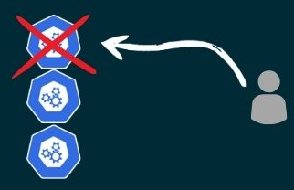

# A deep dive into Kubernetes

---

## Andrew Pruski

### Field Solutions Architect
#### Microsoft Data Platform MVP
#### Docker Captain
#### VMware vExpert

<!-- .slide: style="text-align: left;"> -->
<i class="fa-brands fa-bluesky"></i><a href="https://bsky.app/profile/dbafromthecold.com">  @dbafromthecold.com</a> 
<i class="fas fa-envelope"></i>  dbafromthecold@gmail.com 
<i class="fab fa-wordpress"></i>  www.dbafromthecold.com 
<i class="fab fa-github"></i><a href="https://github.com/dbafromthecold">  github.com/dbafromthecold</a>

---

### Session Aim
<!-- .slide: style="text-align: left;"> -->

 
To dive into Kubernetes to explore the various components and options for deploying applications

---

### Agenda

TBD

---

# Kubernetes Nodes
<!-- .slide: style="text-align: left;"> -->

---

### Node Types
<!-- .slide: style="text-align: left;"> -->

Two different types of Kubernetes nodes: -

  

    

      Control Nodes
    

    
  

  

 <!-- Adjust the width to control the spacing -->
  

    

      Worker Nodes
    

    
  

---

# Control Nodes
<!-- .slide: style="text-align: left;"> -->

---

### Control Node Components
<!-- .slide: style="text-align: left;"> -->

Managing the cluster: -
<ul>
  <li class="fragment">kube-apiserver</li>
  <li class="fragment">etcd</li>
  <li class="fragment">kube-scheduler</li>
  <li class="fragment">kube-controller-manager</li>
  <li class="fragment">cloud-controller-manager</li>
</ul>

---

### The API Server
<!-- .slide: style="text-align: left;"> -->

RESTful API endpoint: -
- The control plane front end
- Exposes the Kubernetes REST API
- Authentication and Authorisation
- Communicates with etcd

---

### ETCD
<!-- .slide: style="text-align: left;"> -->

A distibuted key value store: -
- A consistent cluster view
- Persist cluster state
- High availability and scalability
- Backup and restore

---

### Kube-Scheduler
<!-- .slide: style="text-align: left;"> -->

Selects nodes to run pods: -
- Evaluates nodes in cluster
- Implements scheduling policies
- Resource allocation
- Load Balancing

---

### kube-controller-manager
<!-- .slide: style="text-align: left;"> -->

Runs the controller processes: -
- Node controller
- Namespace Controller
- Service Controller
- StatefulSet Controller

---

### Control Node High Availability
<!-- .slide: style="text-align: left;"> -->

Control Plane HA is a must!
- Multiple control nodes
- Load balancing across nodes
- Etcd cluster
- Managed K8s clusters

---

# Worker Nodes

---

### Worker Node Components
<!-- .slide: style="text-align: left;"> -->

Running applications: -
<ul>
  <li class="fragment">kube-proxy</li>
  <li class="fragment">kubelet</li>
  <li class="fragment">container runtime</li>
</ul>

---

### Kube-proxy
<!-- .slide: style="text-align: left;"> -->

Maintains network rules on nodes: -
- Communication between pods and services
- Service discovery
- Endpoint monitoring
- Uses IP tables (or IPVS)

---

### Kubelet
<!-- .slide: style="text-align: left;"> -->

Lifecycle management of pods: -
- Interacts with the container runtime
- Reports node status
- Containers are running and healthy

---

### Container Runtime
<!-- .slide: style="text-align: left;"> -->

Interacts with the kubelet to: -
- Manage the lifecycle of containers
- Pull images from registry
- Provides isolation
- Used to be Docker

---

### Why no longer Docker?
<!-- .slide: style="text-align: left;"> -->

 

- Docker support hardcoded
- Added support for other runtimes
- Implementation of the CRI
- Dockershim no longer needed

---

# Demo
<!-- .slide: style="text-align: left;"> -->

---

# Deploying Applications
<!-- .slide: style="text-align: left;"> -->

---

### Daemonsets
<!-- .slide: style="text-align: left;"> -->

Runs a pod on every node in the cluster: -
- Log collection
- Monitoring
- Not really a use case for SQL Server!

---

### Deployments
<!-- .slide: style="text-align: left;"> -->

Declarative method to spin up applications: -
- Desired state in yaml file
- Self-healing
- Easy updates and rollbacks
- Typically for stateless apps

---

### Statefulsets
<!-- .slide: style="text-align: left;"> -->

Valuable for applications requiring: -
- Unique network identifiers
- Persistent storage
- Graceful deployment and scaling
- Ordered rolling updates

---

# Demo
<!-- .slide: style="text-align: left;"> -->

---

# Persisting Data
<!-- .slide: style="text-align: left;"> -->

---

### Persisting Data
<!-- .slide: style="text-align: left;"> -->

  

    

      Storage  
      Classes
    

    
  

  

    

      Persistent Volumes
    

    
  

  

    

      Persistent Volume Claims
    

    
  

---

# Demo
<!-- .slide: style="text-align: left;"> -->

---

### Resources
<!-- .slide: style="text-align: left;"> -->

<a href="https://github.com/dbafromthecold/k8sdeepdive">https://github.com/dbafromthecold/k8sdeepdive</a> 

  

